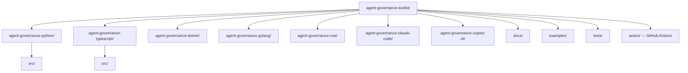

# Agent Governance Toolkit — Codebase Structure

← [[../agent-governance-toolkit|Back to Agent Governance Toolkit]]

## Directory Map

## What Each Directory Does

- **agent-governance-python/** — Python SDK for agent policy evaluation and governance
- **agent-governance-typescript/** — TypeScript/Node SDK — same API surface as Python
- **agent-governance-dotnet/** — C# SDK
- **agent-governance-golang/** — Go SDK
- **agent-governance-rust/** — Rust SDK
- **agent-governance-claude-code/** — Claude Code integration hooks and commands
- **agent-governance-copilot-cli/** — GitHub Copilot CLI integration
- **docs/** — architecture guides, API docs, video series links
- **action/** — GitHub Actions for governance attestation and security scanning
- **examples/** — policy evaluation examples per SDK

## Key Entry Points for Contributing

- `docs/` — add architecture docs or video links (zeel2104's exact pattern — 4 PRs merged)
- `examples/` — add a policy evaluation example
- `tests/` — add test coverage for any SDK
- Any SDK `src/` — add a missing feature consistent across other SDKs
