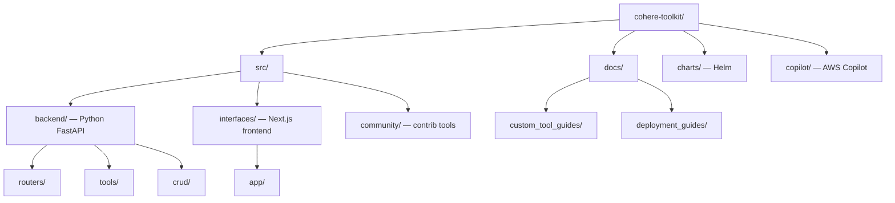

# Cohere Toolkit — Codebase Structure

← [[../cohere-toolkit|Back to Cohere Toolkit]]

## Directory Map

## What Each Directory Does

- **src/backend/** — Python FastAPI: chat endpoints, tool execution, RAG pipeline, auth
- **src/backend/tools/** — pluggable tools (calculator, search, Python interpreter, file reader)
- **src/interfaces/** — Next.js chat UI: the web frontend users interact with
- **src/community/** — community-contributed tools and connectors
- **docs/custom_tool_guides/** — how to write a custom tool — clearest contribution path
- **docs/deployment_guides/** — AWS, Azure, GCP deployment instructions
- **charts/** — Helm chart for Kubernetes deployment

## Key Entry Points for Contributing

- `src/community/` — add a community tool (well-documented, welcoming)
- `docs/custom_tool_guides/` — document a new tool pattern
- `src/backend/tools/` — improve or fix an existing built-in tool
- `docs/deployment_guides/` — add a deployment guide for a new platform
