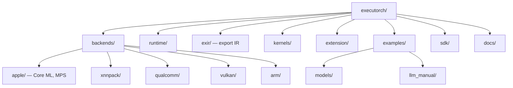

# ExecuTorch — Codebase Structure

← [[../executorch|Back to ExecuTorch]]

## Directory Map

## What Each Directory Does

- **exir/** — export pipeline: takes a PyTorch model → ExecuTorch IR → ready for deployment
- **backends/** — one directory per hardware target: Apple (Core ML/MPS), Qualcomm, ARM, Vulkan, XNNPACK
- **runtime/** — C++ execution runtime: memory planning, operator dispatch, execution
- **kernels/** — portable and optimized op implementations
- **extension/** — Python utilities, data loader, tensor utils
- **examples/models/** — export + run scripts for Llama, Gemma, MobileNet, etc.
- **sdk/** — profiling, debugging, model inspection tools

## Key Entry Points for Contributing

- `backends/xnnpack/` or `backends/apple/` — add operator support for a specific backend
- `examples/models/` — add a new model export example (zeel2104's pattern — Gemma 4)
- `kernels/` — add a portable kernel implementation
- `docs/` — improve deployment guides
