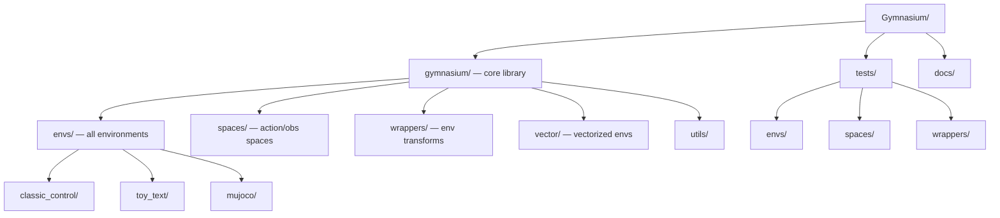

# Gymnasium — Codebase Structure

← [[../gymnasium|Back to Gymnasium]]

## Directory Map

## What Each Directory Does

- **gymnasium/envs/** — all environments: classic_control (CartPole, MountainCar), toy_text, MuJoCo, Atari
- **gymnasium/spaces/** — observation and action space types (Box, Discrete, Dict, Tuple)
- **gymnasium/wrappers/** — env transformations: TimeLimit, RecordEpisodeStatistics, NormalizeObservation
- **gymnasium/vector/** — vectorized env execution (sync and async)
- **gymnasium/utils/** — env checking, passive checkers, seeding
- **tests/** — matches src structure exactly

## Key Entry Points for Contributing

- `gymnasium/wrappers/` — add a new environment wrapper (clear interface, fast merge)
- `gymnasium/envs/` — add a new environment or fix an existing one
- `tests/wrappers/` — add tests for existing wrappers
- `docs/` — improve environment documentation
