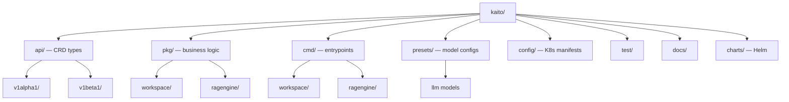

# Kaito — Codebase Structure

← [[../kaito|Back to Kaito]]

## Directory Map

## What Each Directory Does

- **api/** — Kubernetes CRD types: Workspace, RAGEngine — defines what users declare in YAML
- **pkg/workspace/** — controller logic: provisions GPU nodes, deploys model pods
- **pkg/ragengine/** — RAG pipeline: vector store, retrieval, generation
- **presets/** — YAML configs for supported models (Llama, Mistral, Phi, Falcon)
- **cmd/** — main entrypoints for controller and RAG engine binaries
- **config/** — RBAC, CRD manifests for deployment
- **charts/** — Helm chart for installing Kaito on a cluster
- **docs/proposals/** — design docs for new features

## Key Entry Points for Contributing

- `presets/` — add GPU instance support or a new model preset (zeel2104's pattern)
- `docs/` — add deployment guides, tutorials
- `test/` — add e2e or unit tests
- `pkg/ragengine/` — improve RAG retrieval logic
