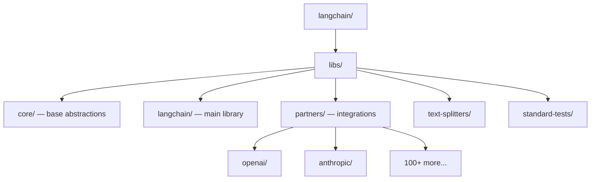

# LangChain — Codebase Structure

← [[../langchain|Back to LangChain]]

## Directory Map

## What Each Directory Does

- **libs/core/** — base classes: BaseChain, BaseRetriever, BaseLLM, BaseMemory — rarely changes
- **libs/langchain/** — main integrations and chains built on core
- **libs/partners/** — one package per integration (OpenAI, Anthropic, Pinecone, etc.) — easiest to contribute
- **libs/text-splitters/** — text chunking strategies for RAG
- **libs/standard-tests/** — shared test suite all integrations must pass

## Key Entry Points for Contributing

- `libs/partners/<new_integration>/` — add a new LLM, embeddings, or vector store integration
- `libs/text-splitters/` — add a new text splitting strategy
- `libs/langchain/` — fix a bug or improve an existing chain
- `libs/standard-tests/` — improve shared test coverage
