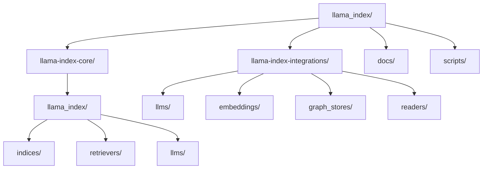

# LlamaIndex — Codebase Structure

← [[../llamaindex|Back to LlamaIndex]]

## Directory Map

## What Each Directory Does

- **llama-index-core/** — base abstractions: indices, retrievers, query engines, node parsers
- **llama-index-integrations/llms/** — one package per LLM provider
- **llama-index-integrations/embeddings/** — one package per embedding model
- **llama-index-integrations/readers/** — data loaders (PDFs, databases, APIs)
- **llama-index-integrations/graph_stores/** — graph database connectors
- **docs/** — API reference, tutorials, example notebooks

## Key Entry Points for Contributing

- `llama-index-integrations/readers/` — add a new data loader (well-defined interface)
- `llama-index-integrations/llms/` — add a new LLM provider
- `llama-index-integrations/embeddings/` — add a new embedding model
- `docs/examples/` — add a notebook example
