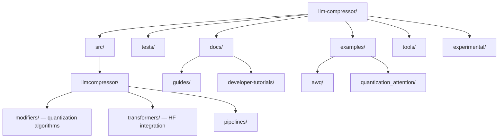

# llm-compressor — Codebase Structure

← [[../llm-compressor|Back to llm-compressor]]

## Directory Map

## What Each Directory Does

- **src/llmcompressor/** — core library: modifiers (GPTQ, AWQ, SparseGPT), pipelines, HuggingFace hooks
- **src/llmcompressor/modifiers/** — one file per quantization algorithm — easiest place to contribute
- **tests/** — pytest tests mirroring src layout
- **examples/** — one folder per quantization method with runnable scripts
- **docs/** — guides, API reference, getting-started tutorials
- **experimental/** — new algorithms not yet stable

## Key Entry Points for Contributing

- `examples/` — add a new quantization example (clear scope, fast merge)
- `src/llmcompressor/modifiers/` — add or extend a quantization modifier
- `tests/` — add missing test coverage (frequently requested in issues)
- `docs/developer-tutorials/` — write a how-to guide
