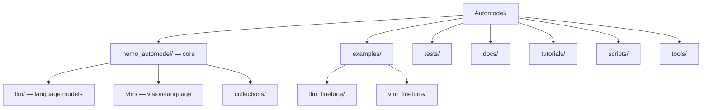

# NeMo Automodel — Codebase Structure

← [[../nemo-automodel|Back to NeMo Automodel]]

## Directory Map

## What Each Directory Does

- **nemo_automodel/llm/** — LLM training: data loading, model configs, training loops
- **nemo_automodel/vlm/** — vision-language models (multimodal training)
- **nemo_automodel/collections/** — dataset and model collection utilities
- **examples/** — one folder per task: pretrain, finetune, generate, benchmark
- **tutorials/** — Jupyter notebooks for learning
- **docs/** — guides, launcher docs, model coverage matrix
- **tools/** — config validation (YAML linter), conversion scripts
- **scripts/** — CI and setup scripts

## Key Entry Points for Contributing

- `tools/` — YAML linting, config validation (zeel2104's pattern — fast merge)
- `docs/` — add tutorial, model coverage, guide
- `examples/` — add a new training example
- `tests/` — unit tests for data loading or model config
