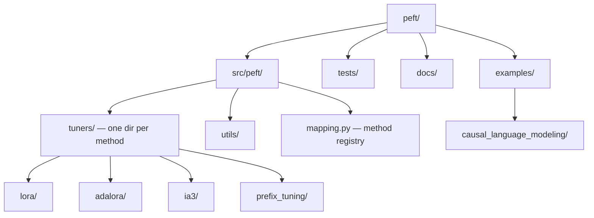

# PEFT — Codebase Structure

← [[../peft|Back to PEFT]]

## Directory Map

## What Each Directory Does

- **src/peft/tuners/** — one subdirectory per PEFT method: LoRA, AdaLoRA, IA³, prefix tuning, prompt tuning
- **src/peft/mapping.py** — registry mapping method names to classes — update this when adding a new method
- **src/peft/utils/** — shared utilities: model loading, config handling, merging
- **tests/** — one test file per tuner method
- **examples/** — fine-tuning scripts for each method

## Key Entry Points for Contributing

- `src/peft/tuners/` — add a new PEFT method (self-contained, clear template to follow)
- `tests/` — add tests for an existing tuner
- `examples/` — add a fine-tuning example for a specific use case
- `docs/source/` — document a tuner's hyperparameters and usage
