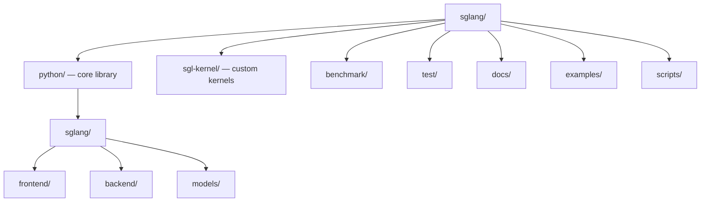

# SGLang — Codebase Structure

← [[../sglang|Back to SGLang]]

## Directory Map

## What Each Directory Does

- **python/sglang/** — main library: frontend language, backend scheduler, model runner
- **python/sglang/backend/** — inference engine, memory pool, scheduler logic
- **python/sglang/models/** — model implementations (Llama, Qwen, etc.)
- **sgl-kernel/** — custom CUDA/Triton kernels, attention ops
- **benchmark/** — throughput and latency benchmarks vs vLLM, Triton
- **test/** — integration and unit tests
- **docs/** — architecture docs, API reference

## Key Entry Points for Contributing

- `python/sglang/models/` — add support for a new model
- `test/` — add test coverage for existing features
- `docs/` — improve documentation
- `benchmark/` — add a benchmark script for a new workload
