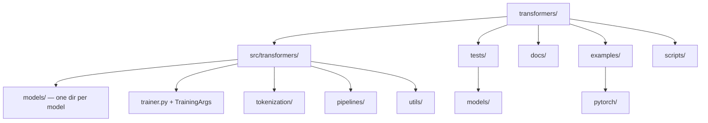

# Transformers — Codebase Structure

← [[../transformers|Back to Transformers]]

## Directory Map

## What Each Directory Does

- **src/transformers/models/** — one subdirectory per model family (llama/, qwen2/, gemma/) — the main contribution target
- **src/transformers/pipelines/** — high-level task pipelines (text-generation, question-answering)
- **src/transformers/trainer.py** — training loop, deepspeed/FSDP integration
- **tests/models/** — model-specific tests, one file per model
- **examples/pytorch/** — full fine-tuning and inference scripts
- **docs/source/** — model cards, API docs, tutorials

## Key Entry Points for Contributing

- `src/transformers/models/<new_model>/` — add a new model (most common contribution)
- `tests/models/` — add missing model tests
- `docs/source/` — improve model documentation
- `src/transformers/pipelines/` — add a new task pipeline
