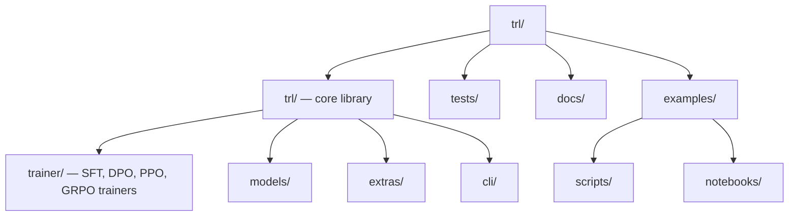

# TRL — Codebase Structure

← [[../trl|Back to TRL]]

## Directory Map

## What Each Directory Does

- **trl/trainer/** — one file per training algorithm (sft_trainer.py, dpo_trainer.py, ppo_trainer.py, grpo_trainer.py)
- **trl/models/** — model wrappers for RLHF (value heads, reward models)
- **trl/extras/** — utilities: dataset processors, reward functions
- **trl/cli/** — command-line interface for training
- **tests/** — pytest, one file per trainer
- **examples/scripts/** — end-to-end training scripts
- **docs/source/** — trainer docs, tutorials

## Key Entry Points for Contributing

- `trl/trainer/` — add a new training algorithm or fix an existing trainer
- `examples/scripts/` — add a training example for a new model/method
- `tests/` — add tests for edge cases in trainers
- `docs/source/` — improve trainer documentation
