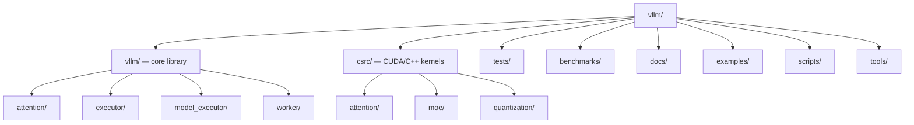

# vLLM — Codebase Structure

← [[../vllm|Back to vLLM]]

## Directory Map

## What Each Directory Does

- **vllm/** — Python core: scheduler, engine, attention backends, model loading, sampling
- **csrc/** — CUDA/C++ kernels: attention ops, MoE routing, quantization kernels
- **tests/** — unit + integration tests, one file per module
- **benchmarks/** — throughput/latency scripts, kernel benchmarks
- **examples/** — end-to-end usage scripts (offline, server, multimodal)
- **docs/** — user docs, architecture guides
- **scripts/** — CI helpers, model conversion tools
- **tools/** — profiling, debugging utilities

## Key Entry Points for Contributing

- `tests/` — add a test for an existing feature, very likely to merge
- `examples/` — add a usage example for a model or feature
- `docs/` — improve or add documentation
- `vllm/model_executor/models/` — add support for a new model architecture
